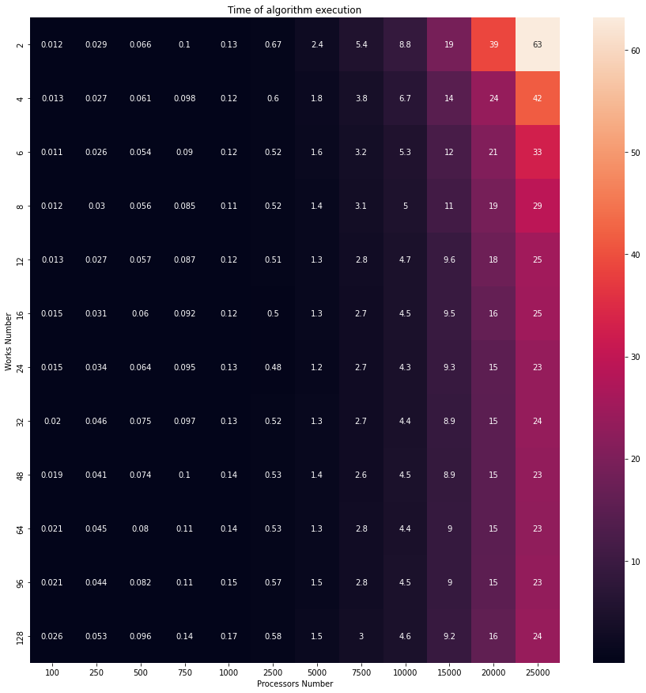
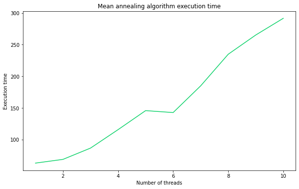
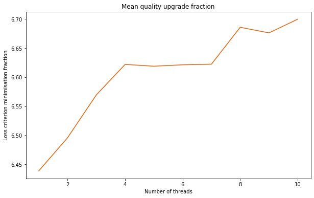

# Исследование последовательного алгоритма.

Для проведения эксперимента выбрана мутация - отправка 10% всех работ на другие процессоры.

В ходе перебора числа процессоров и работ (для закона Больцано) были найдены входные данные, при которых алгоритм работает достаточно долго. (Взято усреднение по пяти прогонам)

Далее представлен эксперимент с выбором закона изменения температуры. Видно, что на самых "тяжелых" данных алгоритм с законом Коши работает чуть дольше, чем с другими законами. При этом процентное улучшение решения после прогона алгоритма не сильно меняется в зависимости от используемого закона. (Взято усреднение по пяти прогонам)

# Исследование параллельного алгоритма.

Для проведения эксперимента выбрана мутация - отправка 0.5% всех работ на другие процессоры.

Ниже приведён график зависимости времени работы параллельного алгоритма от значения Nproc (число процессоров и работ фиксировано). Видно, что скорость растет почти монотонно, однако на 6-ти Nproc-ах виден локальный минимиум. Предположение в том, что это связано с особенностью системы, на которой тестировалась работа алгоритма. Из-за фоновых задач, на 7-ми Nproc-ах уже не такой выигрыш в скорости.

В вопросе качества найденного решения, параллельный алгоритм однозначно уделывает последовательный. Скорее всего это связано с большим обшим числом мутаций и более сложным (тем больше итераций алгоритмов (Nproc * 10), чем больше Nproc стоит) выходом из алгоритма.

Ниже приведён график зависимости среднего качества работы алгоритма (где качество - количество раз, в которое удалось улучшить изначальное расписание по минимизируемому критерию) от значения Nproc (число процессоров и работ фиксировано):

# Параметры системы:

 - ЦП: Intel(R) Core(TM) i5-4570 CPU @ 3.20GH
 - Память: 16.0 ГБ DDR3
 - ОС: WSL 2: Ubuntu-20.04
 - Ядро: 5.10.16.3-microsoft-standard-WSL2 
 - Компилятор: gcc-10-base:amd64